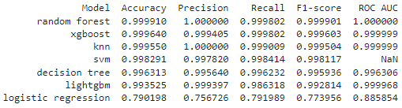

# CapClassifier
**CapClassifier:** A Poisonous Mushroom Classification Project is a data-driven machine learning project aimed at classifying hypothetical mushrooms as edible or poisonous. Leveraging a dataset of 61,069 entries across 173 species with detailed physical attributes, this project serves as a practical exercise to enhance machine learning skills and understanding of classification systems.<br>

# Features
**Data Exploration:** Thorough examination and visualization of the mushroom attributes to understand their distributions and potential influence on edibility.<br>
**Data Preprocessing:** Implements techniques such as cleaning, normalization, and encoding to prepare data for model training.<br>
**Model Training:** Utilizes multiple machine learning algorithms to determine the most effective model based on various performance metrics.<br>
**Model Evaluation:** Applies metrics such as accuracy, precision, recall, F1 score, and ROC curves to evaluate model performance on validation and test datasets.<br>

# Technologies Used
**Python:** Primary programming language for development.<br>
**Pandas & NumPy:** For data manipulation and numerical operations.<br>
**Scikit-learn:** Used for building, training, and evaluating models.<br>
**Matplotlib:** For generating ROC curves and other relevant plots.<br>
**XGBoost & LightGBM:** Advanced frameworks for improving model accuracy and training efficiency.<br>

# Dataset Description
The dataset utilized in this project comprises 61,069 hypothetical mushrooms categorized by their edibility. Each entry is described using 20 distinct attributes, including cap characteristics, stem features, habitat, and season.<br>

# Installation
This project supports two environments setup methods: using Conda and using Pip. Depending on your environment management preference, follow one of the setup instructions below.<br>

# Using Conda
```
git clone https://github.com/prou0242/CapClassifier.git
cd CapClassifier
conda create --name mushroom_classification --file conda-requirements.txt
conda activate mushroom_classification

# If jupyterlab is not already installed:
conda install jupyterlab
```

# Using Pip
```
git clone https://github.com/prou0242/CapClassifier.git
cd CapClassifier
python -m venv venv
source venv/bin/activate
pip install -r pip-requirements.txt

# If jupyterlab is not already installed:
pip install jupyterlab
```

# Usage
```
# Launch JupyterLab
jupyter lab

# Alternatively, launch Jupyter Notebook
jupyter notebook
```

# Testing
The dataset is divided into three subsets to ensure the model is capable of generalizing on unseen data.<br>
**Training Set:** Used to train the model, allowing it to learn patterns contained in the data.<br>
**Testing Set:** Serves as a test set to fine-tune the model parameters and prevent over-fitting.<br>
**Validation Set:** Acts as the final evaluation, used only after the model has been trained and tuned. This provides an unbiased assessment of model performance as the data has not been seen by the model during training. <br>
<br>
The results of the validation are depicted in the image below:<br>

